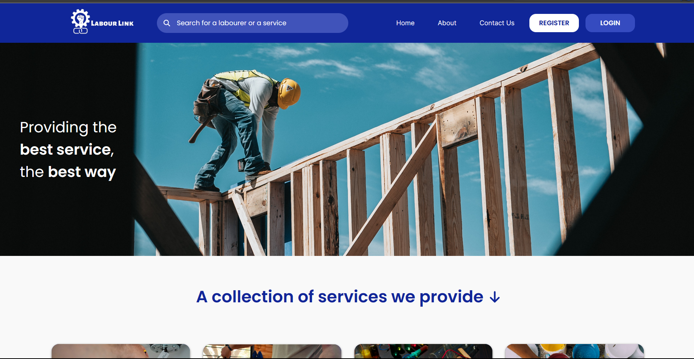

<div align="center">


# Labour Link

### Connecting Customers with Skilled Workers Anytime, Anywhere


A web-based labour hiring platform that bridges the gap between customers and skilled workers by providing a simple, secure, and efficient booking system for household and construction services.

</div>

---

# 📖 Overview

Labour Link is a full-stack web application developed to simplify the process of hiring skilled labourers. The platform enables customers to easily search, book, and review workers while allowing labourers to manage their profiles, bookings, and earnings.

The application provides a centralized platform for multiple service categories including:

- 🛠 Carpenter
- ⚡ Electrician
- 🚰 Plumber
- 🎨 Painter
- 🌱 Gardener
- 🧹 Housekeeping
- 🔧 Mechanic
- 🧱 Mason

---

# 🖼 Project Preview

<p align="center">

</p>

---

# ✨ Features

## Customer

- Customer Registration & Login
- Search Skilled Workers
- Filter by Worker Category
- Book Workers
- Track Booking Status
- Payment Management
- Submit Ratings & Reviews
- Manage Profile

---

## Worker

- Worker Registration
- Professional Profile
- Service Category Management
- Accept/Reject Bookings
- Booking History
- Payment Details
- Customer Ratings
- Profile Management

---

## Admin

- Dashboard Analytics
- Manage Customers
- Manage Workers
- Manage Housing Services
- Booking Reports
- User Management
- Feedback Management
- Payment Monitoring

---

# 🏗 System Architecture

```
Customer
        │
        ▼
Frontend (HTML • CSS • Bootstrap • JavaScript)
        │
        ▼
PHP Backend
        │
        ▼
MySQL Database
```

---

# 💻 Tech Stack

## Frontend

- HTML5
- CSS3
- Bootstrap
- JavaScript

## Backend

- PHP

## Database

- MySQL

## Tools

- XAMPP
- Git
- GitHub
- PHPMailer

---

# 📂 Project Structure

```
Labour-Link/
│
├── admin/
├── api/
├── assets/
├── components/
├── customer/
├── images/
├── models/
├── scripts/
├── styles/
├── worker/
│
├── db.php
├── index.php
├── login.php
├── logout.php
├── README.md
└── mailconfiguration.php
```

---

# 🚀 Installation

### Clone Repository

```bash
git clone https://github.com/YourUsername/Labour-Link.git
```

### Open Project

Move the project inside

```
xampp/htdocs/
```

### Create Database

- Open phpMyAdmin
- Create a new database
- Import the SQL file

### Configure Database

Update credentials inside

```
db.php
```

### Start Server

- Apache
- MySQL

Visit

```
http://localhost/Labour-Link/
```

---

# 📊 Main Modules

- Authentication System
- Customer Management
- Worker Management
- Booking System
- Payment Module
- Housing Service Module
- Feedback System
- Reports & Analytics
- Email Notifications

---

# 🔒 Security Features

- Session Authentication
- Form Validation
- SQL Injection Prevention
- Password Encryption
- Role-Based Access Control
- Secure Login System

---

# 📈 Future Enhancements

- Google Maps Integration
- Live Worker Tracking
- Online Payment Gateway
- AI-based Worker Recommendation
- Chat System
- Mobile Application
- Push Notifications
- Multi-language Support

---

# 🎯 Learning Outcomes

This project helped in understanding:

- Full Stack Web Development
- PHP Backend Development
- MySQL Database Design
- CRUD Operations
- Authentication & Authorization
- REST APIs
- Responsive Web Design
- Git & GitHub
- Project Deployment

---

# 👨‍💻 Author

**Gourav Deswal**

B.Tech Computer Science & Engineering

GitHub: https://github.com/Gouravdeswal

LinkedIn: *(Add your LinkedIn URL)*

---

# ⭐ Support

If you found this project helpful,

⭐ Star this repository

🍴 Fork it

🛠 Contribute to improve Labour Link
---
